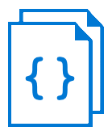

# Docsify Template
> How to build a docs site with _Docsify-JS_ and Github Pages

[](https://docsify.js.org/)
[](https://GitHub.com/MichaelCurrin/docsify-template/tags/)
[](https://github.com/MichaelCurrin/docsify-template/blob/master/LICENSE)

Convert your docs folder into a pretty docs website using [Docsify-JS](https://docsify.js.org/) and some minimal setup instructions. This project's doc site itself is also running on _Docsify_.

If you know what _Docsify_ is and want to start using it immediately, feel free to skip to one of these sections:

- [Quickstart local server](#quickstart-local-server) - Get a demo site running.
- [Setup your own docs site](#setup-your-own-docs-site) - Convert your docs directory into a docs site hosted on Github pages. Uses templates files to get up and running with as little effort as possible.

_Note: The instructions in this repo are intended for Linux and macOS environments._

## Why use _Docsify_?

My requirement is to build a docs site with minimal setup to use existing docs directories without restructuring or formatting the docs. I found _Docsify_ is ideal for this.

You can use _Docsify_ with its defaults or very simple tweaks, yet get a UI with menus, themes, mobile functionality and a cover page. And page loads are seamless in the shell as it is a SPA. These things that take more effort and code changes or additions if you want to do them with static-site generators. _Docsify_ also documentation as its main purpose, unlike some other tools.



## _Docsify_ basics

A _Docsify_ doc site works works _without_ the need to edit your existing docs and _without_ building any HTML pages. The rendering is done on the client-side in a single page application, running on _index.html_.

### Structure

Main components of a _Docsify_ site.

- **cover page** - Optional. Landing page with background color or image and some minimal text.
- **homepage** - First page that a user sees, after the cover page. This is a content page written in markdown and it could be the only page of your site if you like.
- **index page** - HTML file base of the app. This includes JS and CSS calls for setting up and styling the _Docsify_ app. Plus JS code which you set to customize the app.
- **sidebar** - Optional. Describes the menu layout for the left sidebar, using custom ordering and nested structure. _Docsify_ is not aware of directory structure, so this is where you get to define your menu. Alternatively, let _Docsify_ create the menu bar based on the structure of your homepage (_docs/README.md) file - this works best if you only have a single content markdown page or a _navbar_ (top of the screen) to switch between sections.
- **navbar** - Optional. Describes the menu layout for the top right menu.

Once you have that setup in _docs_ directory and have pushed to Github, you can setup Github Pages serving the _docs_ directory. Note: _Docsify_ also works with _Netlify_ as per their docs, but this project just considers the Github Pages case.

### Linking to pages

Instructions for creating valid Docsify links in your markdown files.

The _Docsify_ site is served from the `docs` directory with restrictions on links between files. Therefore you must ensure your markdown files (including the [sidebar](#sidebar)) are valid.

As usual external resource can be linked e.g. `https://example.com`.

**Rules for internal links**

Apply these rules to the latter part of markdown URLs such as `[Text](page.md)`.

- Links must always be relative to the `docs` directory and **not** to the file containing the link.
    - e.g. `foo.md`, which becomes `/#/foo`.
    - e.g. `baz/fizz.md`, which becomes `/#/baz/fizz`.
- Links may contain a leading forward slash. This has no effect so can be ignored.
    - e.g. `/foo.md`, which becomes `/#/foo`.
- Links may use an ID.
    - e.g. To link to heading on the homepage, use `#my-project`, which gets converted to `/#/?id=my-project`.
    - e.g. To link to another page, use `foo.md#my-project`.
- Do not reference the `docs` directory in the path. e.g. `/docs/foo.md`
- Do not refer to content outside of the `docs` directory.  e.g. `../README.md`

## Serve a _Docsify_ site locally

Start running a local server to preview a _Docsify_ site. Choose an option below depending on whether you want to install and run Docsify locally or use something you already have installed.

-   Run [Docsify CLI](#docsify-cli) web server.
    ```bash
    $ # From project root.
    $ docsify serve docs
    $ # Shortcut.
    $ make docs
    ```
-   Run a Python web server.
    ```bash
    $ cd docs
    $ python3 -m http.server 3000
    ```
- Choose something else from this big list - [link](https://gist.github.com/willurd/5720255).

## Quickstart local server

Follow these steps to setup and run an existing _Docsify_ project locally . In this case, we get a local copy of this _Docsify Template_ project and serve it.

### 1. Install

Clone this repo to your machine with one of these commands:

```bash
$ # Clone with SSH
$ git clone git@github.com:MichaelCurrin/docsify-template.git
$ # Clone with HTTPS
$ git clone https://github.com/MichaelCurrin/docsify-template.git
```

```bash
$ cd docsify-template
```

No installation is needed. When the HTML page is opened in the browser, the _Docsify_ library will be fetched from a CDN by the browser.

### 2. Run

#### 2.1 Serve

Follow [Serve a Docsify site locally](#serve-a-docsify-site-locally) instructions.

#### 2.2 View

Open http://localhost:3000 in the browser.

User notes:

- When viewing the site, if you scroll down far enough you will see a hamburger menu which lets you dynamically open or close the sidebar.


## Setup your own docs site

This tutorial is based on the _Docsify_ [Quickstart](https://docsify.js.org/#/quickstart) guide, but rather than giving snippets of file this tutorial lets you copy entire template files to your project, there are `TODO` items in the templates making it clear what to edit. Plus in the template, there are some useful or pretty configurations which have been set after investigating the configurations guide and trying them out on my own project.

Follow to steps in this section copy a base structure and configs from this project to your own, then customize them for your needs.

### 1. Get this project locally

Clone this template repo to your machine using one of the steps below, so you can use it copy files from later.

```bash
$ # Clone with SSH
$ git clone git@github.com:MichaelCurrin/docsify-template.git
$ # Clone with HTTPS
$ git clone https://github.com/MichaelCurrin/docsify-template.git
```

```bash
$ cd docsify-template
```

### 2. Create base structure

1. Navigate to your existing project's `docs` directory.
    ```bash
    $ cd <PATH_TO_YOUR_REPO>/docs
    ```
2. Copy the copy the contents of the template project's _quickstart_ directory to your own project. Note the trailing dot on the first path in order to include hidden files.
    ```bash
    $ cp <PATH_TO_TEMPLATE_REPO>/quickstart/. .
    ```
3. View the contents of the docs directory to see what was added. Note that _Docsify_ provides a `404 - Not found` page for a bad URL so you do not need to.
4. To see what the base site look like, start a server now using a command from the [serve](#21-serve) section. Open the web page URL and keep it open so you can check on it as you make changes in the following sections. If you use the _Docsify_ server, the page will auto refresh on a file save, otherwise you will have to manually refresh.


### 3. Configure homepage

Edit your homepage (_docs/README.md_). Complete the `TODO` items, using the suggestions in this section.

- Anything outside of your _docs_ directory will **not** be served. Therefore you might want copy the the content from your project root's _README.md_ to the homepage. After that, you could make the root _README.md_ very short, if you don't want to worry about keeping two identical files in sync.
- You might want to opt for short homepage file if you prefer to put more documentation in other _docs_ files.
- Note that you are not required to put in links to other docs file within your homepage file. As that is what the _Docsify_ sidebar. If you do put in any links in your homepage, they must be relative to the _docs_ directory, such as `file.md`. See [Doc links](#doc-links) for more info.


### 4. Configure menu structure

#### Auto sidebar

You may choose to display the sidebar, but have it populated automatically from headings on a single HTML file - the homepage (_docs/README.md_). This is the way that this project's own docs site is setup.

This solution is great if you are happy to move all your doc content into a **single** markdown file, as it means not having to worry about manually updating a navigation bar when you docs change. Especially if you have a many files to manage or they are likely to change in name or structure.

To setup auto sidebar:

1. Delete *_sidebar.md*.
2. Open _index.html_ to edit it.
3. Set `loadSidebar: false` and save.

Warning: If you go for this option without a configured sidebar, do not leave any links in your _docs/README.md_ which refer to other doc files. Although the link may be valid, once you click on the link, the sidebar on that page will reflect the target page rather than the outline of the _docs/README.md_ page, which is inconsistent and jarring behavior.

#### Custom sidebar

You can choose to configure a custom sidebar. This is necessary to link to the multiple doc files.

##### Guidelines

How to setup a sidebar file:

- The format should be bullet points in markdown format.
- Each menu item should be a markdown link e.g. `[Name](link)`. An item may exist on the menu without a link - this is useful for grouping items together under a menu heading.
- The links must be follow restrictions noted above in [Linking to pages](#linking-to-pages). If the doc files change (e.g. are renamed or moved), you need to remember to update the sidebar config.
- The bullet points may optionally be nested, using indentation. You may create arbitrary indentation in your sidebar, even if all you files are at the same level in the _docs_ directory.

Example:

[_sidebar.md](https://raw.githubusercontent.com/MichaelCurrin/docsify-template/master/nested_example/_sidebar.md ':include :type=code')

##### Setup custom sidebar

1. Ensure `loadSidebar: true` is set in the _index.html_ file.
    - The value of `true` means `*_sidebar.md*` will be referenced by the app.
    - The sidebar is already enabled in the quickstart [index.html](https://github.com/MichaelCurrin/docsify-template/blob/master/quickstart/index.html).
2. Edit the *_sidebar.md* file.
3. Add items using the guidelines above.

##### Note on Home link

The clickable text above the standard sidebar takes you to the cover page. You can scroll down to the homepage (_docs/README.md_), but there are no links on the page to the homepage. So add a link to the homepage with the first entry above. Note: An alternative is to use the nav bar config for Home button, rather than sidebar config.

```
- [Home](/#my-app)
```

NB. The leading forward slash is **required** here for correct behavior. As the anchor tag will be invalid on other pages such as `foo.md` which has path `/#/foo/`).

The link is a reference to an anchor tag on the root URL, where anchor tag refers the ID of the homepage heading element. This ID will be created by _Docsify_. To find it, go to the coverpage, scroll down to the homepage and click on the heading. The URL will be something like `http://localhost:3000/#/?id=my-app`. The part we want is the end e.g. `my-app`.

This is really the text of heading element, which has been made lowercase and hyphenated. Copy this to the sidebar file and prefix it with a hash symbol.

### 5. Configure cover page

The cover page is the first page that a visitor sees before scrolling down to the homepage.

If you want to use it, edit your *docs/_coverpage.md* file and complete the `TODO` items. You can also use this project's [cover page](https://raw.githubusercontent.com/MichaelCurrin/docsify-template/master/docs/_coverpage.md) on Github as a reference.

You can add additional buttons to the bottom of the homepage, but there should be no gaps between the lines in your file. And the last one will be solid while the others will be transparent.

The _Docsify_ site explains how to set a background image or color [here](https://docsify.js.org/#/cover?id=custom-background). A background image should come _after_ the buttons in your file, as _Docsify_ looks for an image there then uses CSS to place the image behind the content and give it faded grey look.

You can delete the cover page and disable it in _index.html_.

#### Image

You could include an image (logo, photo) above your project title. For example, you could do this if you have a file in a *docs/_media* directory.

```

```

### 6. Configure Style

Edit _index.html_.

#### 6.1 Color

Optionally set a theme color. This affects how some content looks, such as quoted blocks, underlined text and buttons. This will default to theme's default if not set manually. i.e. green for _Vue_ and blue for _Buble_.

```js
window.$docsify = {
  themeColor: '#3F51B5',
};
```

More on Docsify [theme color](https://docsify.js.org/#/configuration?id=themecolor).

#### 6.2 Themes

Find the style which is set in the `<head>` tag, which looks like this.

```html
<link rel="stylesheet" href="//unpkg.com/docsify/lib/themes/<THEME>">
```

Replace the end of URL with one of these four themes:

- `vue.css`
- `buble.css`
- `dark.css`
- `pure.css`

You can optionally remove `/lib` from the theme URL to get the _uncompressed_ CSS file.

Read more on the _Docsify_ [themes](https://docsify.js.org/#/themes?id=themes) guide.

Note: The _Buble_ theme has sidebar headings which are not distinguished from the sub items. Therefore you can add this to _index.html_ to get bold headings similar. Based on _vue.css_.

```html
<style>
    .sidebar .sidebar-nav>ul>li {
        font-weight: 700;
        margin: 0;
    }
</style>
```

### 7. Advanced configuration

The configuration steps above already get you a prettier and more usable site in my opinion than the barebones one which the _Docsify_ `init` command or their _Quickstart_ guide gives you. This section covers advanced steps - you may skip these and jump straight to the [Github Pages](#setup-github-pages-site) section.

#### App configuration

You can update the config parameters passed in on the _index.html_ page. There are some useful things there in like adjusting the sidebar levels, putting a logo in the sidebar or setting your root _README.md_ as your homepage. There is even a search bar you can add.

For available parameters, these are documented on the _Docsify_ [Configuration](https://docsify.js.org/#/configuration) page.

For defaults - see _Docsify_ [config.js](https://github.com/docsifyjs/docsify/blob/develop/src/core/config.js) script.

See some values below which are worth considering for the siderbar.

```js
window.$docsify = {
  // Maximum Table of Contents (TOC) level. Default value shown here.
  maxLevel: 6,

  // Add table of contents (TOC) in custom sidebar. Default value shown here. Try a value of 2.
  subMaxLevel: 0,

  logo: '/_media/icon.svg',

  name: 'docsify'
}
```

Change the homepage. These recommendations come from the docs.

```js
window.$docsify = {
  // Change to /home.md
  homepage: 'home.md',

  // Or use the readme in your repo
  homepage: 'https://raw.githubusercontent.com/docsifyjs/docsify/master/README.md'
};
```

#### Plugins

Highlights from the [List of Plugins](https://docsify.js.org/#/plugins?id=list-of-plugins) on the _Docsify_ site.
- [External script](https://docsify.js.org/#/plugins?id=external-script) - If the script on the page is an external one (imports a js file via src attribute), you'll need this plugin to make it work.
- [Google Analytics](https://docsify.js.org/#/plugins?id=google-analytics) - Add tracking.
- [Tabs](https://docsify.js.org/#/plugins?id=tabs) - A docsify.js plugin for displaying tabbed content from markdown.

Also of interest:
- For pulling in JSON data and not just markdown files:
    - [bandorko/docsify-variables](https://github.com/bandorko/docsify-variables)
    - [kissybnts/docsify-json-variables](https://github.com/kissybnts/docsify-json-variables) or on [npm](https://www.npmjs.com/package/docsify-json-variables)

#### Favicon

Optionally customize _index.html_ to point to a custom _favicon_, if you added one.

```html
<link rel="icon" href="_media/favicon.ico">
```

## Setup Github Pages site

If you followed the steps above, you'll have a locally running docs site.

Now, commit and push the files to Github.

Next, edit your repo's setting on Github. Select the option to serve the `docs` directory of the `master` branch as Github Pages site. When you refresh the settings page, then you will see a link to your site there.

Open the link in the browser.


## Write content

This section deals with how to update and add to the content of your doc files.

### Embed

You can embed content such as video, audio, iframes (`.html`), code blocks or even Markdown files.

#### Format

Add the `':include'` parameter in a markdown URL reference. Here is the format:

```markdown
[filename](url ':include')
```

The URL could be a local file (e.g. `_media/foo.js`) or a remote URL `https://...`.

If you want to embed a code block, you can use the automatic formatting. But markdown and HTML files need to be marked as a code if you want them as code rather than HTML.

```
':include :type=code'
```

See the _Docsify_ [Embed](https://docsify.js.org/#/embed-files) help for forcing types and using fragments.

#### Examples

#### Render markdown

Render markdown as HTML.

```markdown
[example.md](https://docsify.js.org/_media/example.md ':include')
```

[example.md](https://docsify.js.org/_media/example.md ':include')

Note: The result is _not_ inside a code block expected. It is inside a quote block because the source content starts with `> `.

#### JS snippet

Auto formatted.

```markdown
[example.js](_media/example.js ':include' )
```

[example.js](_media/example.js ':include' )

#### Markdown snippet

Force to code snippet.

```markdown
[_sidebar.md](_coverpage.md ':include :type=code')
```

[_sidebar.md](_coverpage.md ':include :type=code')

#### Warnings

- Do not put the URL in a bullet point as it will become an ordinary link.
- Do not put two embed items in a sequence without some characters in between, otherwise you will get a JS error rending the page. Putting an empty line between them is **not** sufficient.
- If you embed a URL of a Github file, remember to use the _Raw_ URL otherwise you will get an error.


## Docsify CLI

_Docsify_ also provides a convenient but optional CLI. It helps you create and serve a Docsify project. In particular, it provides hot reloading by default when using the server - an open localhost webpage will refresh when project files are saved.

### Setup

```bash
$ npm i docsify-cli -g
```

Links for installing and using the CLI.

- [Docsify Quickstart](https://docsify.js.org/#/quickstart) on _Docsify_ homepage.
- [Docsify CLI](https://docsifyjs.github.io/docsify-cli) project's docs.

### Commands

#### init

> Creates new docs

Setup an initial _README.md_ (duplicated from project root), _index.html_ and _.nojekyll_ in your a target directory. If you don't want the CLI to do it for you, you can create the files by hand or use this project's _quickstart_ directory to get you going.

e.g.

```bash
$ docsify init docs
```

#### serve

> Run local server to preview site.

Serve the target directory as a docs site locally. This includes hot reload, to refresh the page on file changes. See [serve](#21-serve) options above.

e.g.

```bash
$ docsify serve docs
```

Serves as [localhost:3000/](http://localhost:3000/), or a different port if there is already a _Docsify_ server running.

#### start

> Server for SSR

This command is for Server-Side Rendering. I haven't tried this yet.

## Static site vs SPA

### Server side rendering

Although SEO crawlers can do better at sites like single page application, _Docsify_ is still said not to be SEO-friendly, compared with static sites where all HTML is pre-rendered.

However, _Docsify_ provides the option of pre-rendering all the views as static HTML. This can improve SEO.

See [Server-Side Rendering](https://docsify.js.org/#/ssr) section of the _Docsify_ docs.

### Why not use a static site generator?

_Docsify_ is a SPA, not a static-site generator.

_Jekyll_ and _Hugo_ are excellent options for static site generators. They can use themes suited to documentation and they can build off of a _docs_ directory. If you want to read more about those, see my [resources](https://github.com/MichaelCurrin/static-sites-generator-resources) project.

These are just tools to build a site. What is appropriate depends on your usecase, how much you need to customized the site and how much effort you want to spend on installing/running/maintaining the project.

I find _Docsify_ light to add to a project and to use for new projects. So it is a great fit for me.

A static site generator can be heavy to setup and manage.

There are dependencies to manage - they might have to be upgraded if their are security vulnerabilities or they are no longer available. Such as plugins and themes for _Jekyll_. And plugins for _Hugo_. Plus you probably need a couple of _JavaScript_ or _CSS_ files that either you or a theme added. Such as _Query_. This _Docsify_ project only needs exactly one _JavaScript_ and one _CSS_ file.

There is HTML to build locally and on the remote. While _Docsify_ needs no dependencies to serve a site, _Jekyll_ sites needs `jekyll` installed and _Hugo_ sites need `hugo` available.

A static site needs to to customize it in depth or setup a theme which also takes effort. You may lose or gain functionality when switching between Jekyll themes because they use their own templates and layouts.

You probably have to add _front matter_ to your doc files so they can inherit from layouts and have the correct metadata like title.

As with _Docsify_, you will probably have to create a config file which covers the structure of your project for use in the sidebar.

Unlike building static files with HTML, with with Docsify there is a single page application running off of a _index.html_ - on each request, a markdown file is fetched by the client and rendered as HTML with a theme and menu. The performance will depend more on the server when serving static HTML pages (prebuild and serve page on the client) or on the client when using a single page application (build structure on the client).

Also, the _Docsify_ approach will only work if _JavaScript_ is enabled.

The _Docsify_ site says it supports back to Internet Explorer 11, so that at least helps for a wider audience of users.
